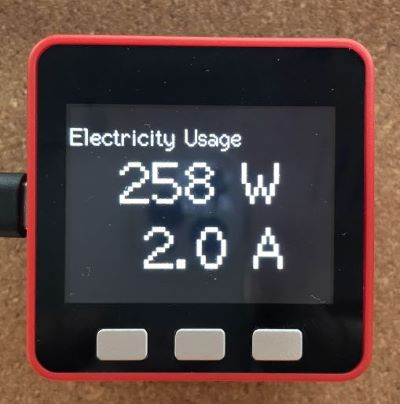

# PowerChecker

B ルートサービスを使用して自宅の電力使用量をリアルタイム可視化するシステム



## Requirement

- Server

  - Linux 環境
  - Rust
  - RHOM BP35C2 Wi-SUN 対応 USB ドングル

- Client

  - M5Stack FIRE (Basic 等でも可)
  - PlatformIO (VSCode, C++)

## Usage

- Server

  1. B ルートサービスに申し込んで ID と PASS を取得する
  1. ./Server_BP35C2/src/config.rs を書き換える
     1. PB35C2 の USB デバイスパス (抜き差し/挿すポートによって変わらないように固定化することを推奨)
     1. Server マシンの IP アドレス (DHCP で変化しないように静的 IP を使用することを推奨)
     1. 使用していない適当なポート番号 (環境によっては Firewall 設定必要)
     1. B ルートサービスの ID/PASS
  1. Rust でビルド
     ```console
     $ cargo build
     ```
  1. Server マシン上で実行
     ```console
     $ cargo run
     ```
     Ubuntu 環境だと、/dev/ttyUSB\* は dialout グループになるようです。
     実行するユーザーアカウントを dialout グループに追加しておく必要があります。
     ```
     $ sudo adduser $USER dialout
     ```
     その後一旦 logout して再度 login。

- Client
  1. ./Client_M5Stack/src/config.cpp を書き換える
     1. 自宅 WiFi の SSID/PASS
     1. Server 側の IP アドレス/ポート
  1. PlatformIO でビルド
  1. M5Stack への書き込み
