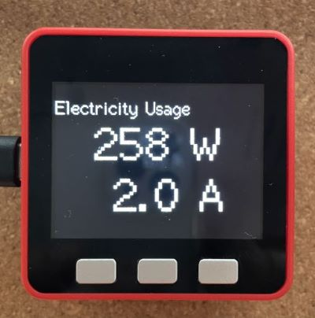

# PowerChecker

B ルートサービスを使用して自宅の電力使用量をリアルタイム可視化するシステム



## 構成

スマートメーターとの通信は Home Assistant の Smart Meter B Route 統合が担当し、
クライアントはそこから値を取得して表示します。

```
スマートメーター --(Wi-SUN/BP35C2)-- Home Assistant
                                        |
                        +---------------+---------------+
                        |                               |
                 Client_M5Stack                  Server_BP35C2
                （テンプレート API を直接参照）  （Client_M5Stack_rs 向け REST 中継）
```

| ディレクトリ | 内容 |
|--------------|------|
| `Client_M5Stack` | M5Stack Fire / Core2 向けクライアント（PlatformIO / C++） |
| `Client_M5Stack_rs` | 同クライアントの Rust / Slint 実装 |
| `Server_BP35C2` | Home Assistant の値を REST API で中継するサーバー |

Home Assistant 側の設定は `~/Docker/HomeAssistant` を参照してください。

## セットアップ

このリポジトリは git submodule を使用しています。

```console
$ git clone --recurse-submodules <リポジトリURL>
```

既にクローン済みの場合:

```console
$ git submodule update --init --recursive
```

各コンポーネントのビルド・書き込み手順は、それぞれのディレクトリの README を参照してください。
